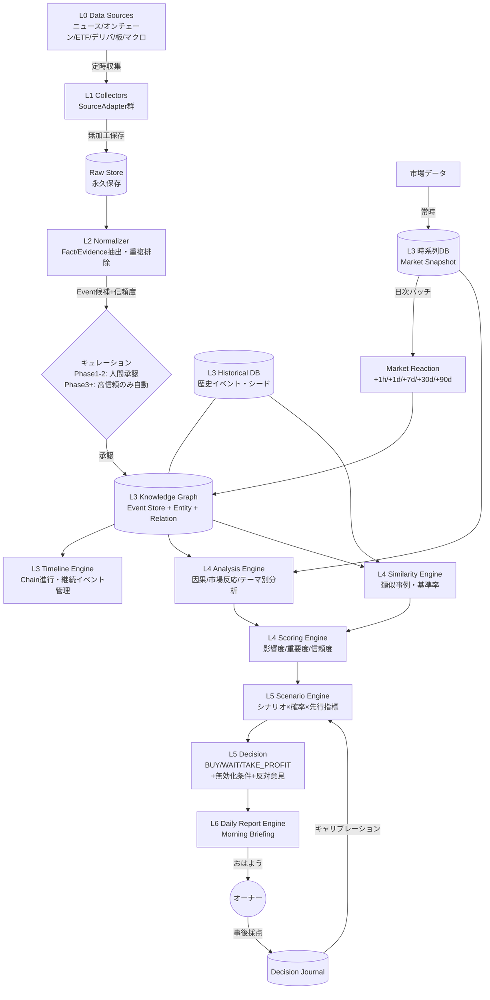
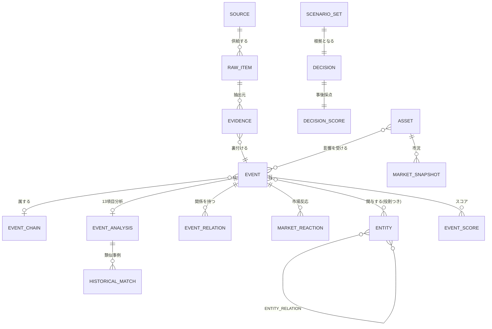
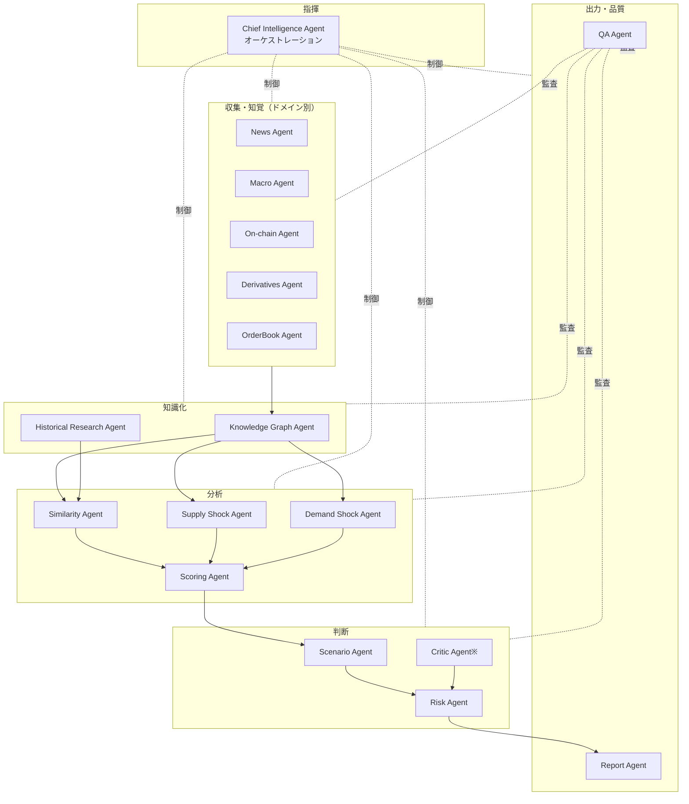

# MASTER_SYSTEM_DESIGN.md
# Bitcoin Intelligence Operating System（BIOS）統合設計書

> **本書の位置づけ**
> - 上位文書：PROJECT_CONSTITUTION.md（憲法）。本書は憲法に従属する。
> - 本書は旧 SYSTEM_ARCHITECTURE.md / DATA_MODEL_AND_KNOWLEDGE_GRAPH.md / AI_AGENT_SPECIFICATION.md の3書を**統合・置換**し、今後の全開発の **Single Source of Truth** とする。
> - 関連文書：DATA_SOURCE_REGISTRY.md（ソース台帳）/ EVALUATION_AND_CALIBRATION.md（精度計測）/ RISK_AND_GOVERNANCE.md（リスク統制）
> - **本書のスキーマ変更は後方互換必須**（フィールド追加は可、意味変更・削除は不可）。破壊的変更はADRとオーナー承認を要する。
> - 本書は設計のみを定める。実装はオーナーのレビュー・承認後に開始する。

---

## 目次

1. [設計原則](#1-設計原則)
2. [Repository Architecture](#2-repository-architecture)
3. [System Architecture](#3-system-architecture)
4. [Knowledge Graph 総論](#4-knowledge-graph-総論)
5. [Entity Design](#5-entity-design)
6. [Relationship Design](#6-relationship-design)
7. [Event Model](#7-event-model)
8. [Evidence / Source / Confidence](#8-evidence--source--confidence)
9. [Timeline Engine](#9-timeline-engine)
10. [Historical Database](#10-historical-database)
11. [市場データモデル（Snapshot / Reaction / Regime）](#11-市場データモデルsnapshot--reaction--regime)
12. [分析・判断データモデル（Analysis / Score / Scenario / Decision）](#12-分析判断データモデルanalysis--score--scenario--decision)
13. [物理スキーマ](#13-物理スキーマ)
14. [AI Agent Architecture](#14-ai-agent-architecture)
15. [Data Pipeline 詳細設計](#15-data-pipeline-詳細設計)
16. [Extensibility（マルチアセット設計）](#16-extensibilityマルチアセット設計)
17. [技術選定（ADR要約）](#17-技術選定adr要約)
18. [非機能要件](#18-非機能要件)
19. [Design Review（セルフレビュー）](#19-design-reviewセルフレビュー)

---

## 1. 設計原則

憲法の各条文をアーキテクチャへ写像する。以下は本書全体を貫く原則である。

| # | 原則 | 憲法根拠 | アーキテクチャへの写像 |
|---|---|---|---|
| P1 | **データ層とAI層の分離** | 第8条 | Event Store（資産）とAgent（消耗品）を疎結合に。AI層を丸ごと交換してもデータは無傷 |
| P2 | **パイプラインは一方向** | 第2条 | Fact→Decision の順序をレイヤー構造とAgentのアクセス制御にそのまま写像。下流は上流の成果物しか見えない |
| P3 | **Event First** | 第3条 | ニュースは保存しない。保存するのはEventとEntity。記事はEvidenceとしてEventに従属 |
| P4 | **追記のみ（append-only）** | 第3条 | Event・Evidence・Decision・監査ログはUPDATE禁止。訂正は訂正レコードの追加で表現 |
| P5 | **証拠なき主張の構造的禁止** | 第4条 | 証拠IDのないFACTはスキーマ検証で機械的に拒否。ラベル（FACT/REPORTED/INFERENCE）必須 |
| P6 | **確率と無効化条件** | 第5条 | 断定出力はスキーマに存在しない。Scenario（確率分布）とInvalidation（無効化条件）が必須フィールド |
| P7 | **計測可能性** | 第6条 | 全判断はDecision Journalへ。全Agent実行は監査ログへ。測れないものは作らない |
| P8 | **一人で5年運用できる** | 第8条 | モジュラーモノリス。分散システム・k8s不採用。依存最小・全再実行可能（冪等） |
| P9 | **アセット非依存** | 第9条(拡張余地) | Bitcoinはコードの前提ではなく**設定とデータ**。全スキーマにアセット次元を持つ（§16） |
| P10 | **すべて差し替え可能** | 第8条 | データソース・LLMモデル・プロンプトは設定ファイル管理。コード変更なしで交換可能 |

---

## 2. Repository Architecture

### 2.1 設計方針

- **`src/` レイアウトの単一Pythonパッケージ（モジュラーモノリス）**。ディレクトリ＝アーキテクチャ層に対応させ、`import` の方向を一方向（上流→下流参照の禁止）に保つ。
- **設計書・プロンプト・設定・シードデータはコードと同格のトップレベル**に置く。これらはコードより寿命が長い資産である。
- オーナー案（collectors/ analyzers/ 等をトップレベルに並べる）は、Pythonパッケージとしての依存管理・テスト・配布が難しくなるため、**`src/bios/` 配下のサブパッケージへ再編**した。概念上の対応は下表に明記する。

### 2.2 ディレクトリ構成

```
invest/
├── README.md
├── pyproject.toml                  # 依存・ツール設定（単一パッケージ）
├── Makefile                        # 定型操作の入口（collect / analyze / brief / backup / test）
│
├── docs/                           # ★設計書（Single Source of Truth）
│   ├── PROJECT_CONSTITUTION.md     #   憲法（最上位）
│   ├── MASTER_SYSTEM_DESIGN.md     #   本書
│   ├── DATA_SOURCE_REGISTRY.md     #   データソース台帳・信頼Tier
│   ├── EVALUATION_AND_CALIBRATION.md
│   ├── RISK_AND_GOVERNANCE.md
│   ├── IMPLEMENTATION_ROADMAP.md   #   （次フェーズで作成）
│   ├── adr/                        #   Architecture Decision Records（連番）
│   └── runbooks/                   #   障害対応・復旧手順・四半期復元訓練
│
├── config/                         # ★全設定（コード変更なしで挙動を変える層）
│   ├── assets/                     #   アセット定義（btc.yaml が第1号。eth.yaml等を将来追加）
│   ├── sources/                    #   ソースアダプタ設定（URL・認証・スケジュール・Tier）
│   ├── taxonomy/                   #   イベント種別 / Entity種別 / Relationship種別（YAML）
│   ├── agents.yaml                 #   Agent毎のモデル・トークン予算・タイムアウト
│   ├── pipelines.yaml              #   ジョブDAG・スケジュール・リトライポリシー
│   └── scoring.yaml                #   スコアリング閾値・重み
│
├── prompts/                        # ★全Agentプロンプト（Git履歴＝プロンプトのバージョン管理）
│   └── <agent_name>/v001.md ...    #   分析レコードに使用バージョンを刻印する
│
├── seeds/                          # ★Historical Database 初期データ（人手＋AI補助で作成）
│   ├── chains/                     #   歴史Event Chain（mtgox.yaml, ftx.yaml, halving.yaml ...）
│   ├── entities/                   #   初期Entityマスタ
│   └── market/                     #   過去市場データの取込定義
│
├── src/bios/                       # アプリケーション本体（層＝サブパッケージ）
│   ├── common/                     #   型定義・スキーマ（Pydantic）・ID規約・時刻規約
│   ├── storage/                    #   DBアクセス・マイグレーション実行・Raw Store・バックアップ
│   ├── ingestion/                  #   L1: SourceAdapter群（1ソース1モジュール・差替可能）
│   ├── extraction/                 #   L2: 正規化・Fact/Evidence抽出・重複排除・Event候補生成
│   ├── knowledge/                  #   L3: Event Store・Knowledge Graph・Entity名寄せ・Timeline Engine
│   ├── history/                    #   L3: Historical Database（シード取込・歴史イベント管理）
│   ├── analysis/                   #   L4: レジーム判定・因果分析・市場反応分析・テーマ別分析
│   ├── similarity/                 #   L4: 類似事例検索・基準率算出
│   ├── scoring/                    #   L4: 影響度・重要度・信頼度スコアリング
│   ├── scenario/                   #   L5: シナリオ生成・確率推定
│   ├── decision/                   #   L5: 判断生成・無効化条件管理・Decision Journal
│   ├── reporting/                  #   L6: Morning Briefing生成・質問応答
│   ├── agents/                     #   Agentランタイム（LLM呼出・スキーマ検証・予算管理・監査ログ）
│   ├── scheduler/                  #   ジョブ実行・DAG制御・リトライ・デッドレターキュー
│   └── audit/                      #   監査ログ・QA検査・キャリブレーション集計
│
├── db/
│   └── migrations/                 # スキーママイグレーション（連番SQL・後方互換必須）
│
├── tests/
│   ├── unit/
│   ├── integration/
│   └── golden/                     # ゴールデンテスト（既知イベント→期待構造出力の回帰）
│
└── ops/                            # バックアップスクリプト・cron定義・環境構築
```

### 2.3 オーナー案との対応表

| オーナー案 | 本設計での配置 | 変更理由 |
|---|---|---|
| `docs/` `architecture/` | `docs/`（＋`docs/adr/`） | 設計書とADRを1系統に統合 |
| `collectors/` | `src/bios/ingestion/` | パッケージ化して依存方向を管理 |
| `analyzers/` | `src/bios/analysis/` | 同上 |
| `knowledge_graph/` | `src/bios/knowledge/` | Timeline EngineとEntity名寄せを同居（強結合のため） |
| `timeline/` | `src/bios/knowledge/`内 | TimelineはGraphの導出ビュー（§9）であり独立層にしない |
| `database/` | `src/bios/storage/` + `db/migrations/` | コードとスキーマ定義を分離 |
| `scoring/` `similarity/` | `src/bios/scoring/` `src/bios/similarity/` | そのまま採用 |
| `reports/` | `src/bios/reporting/` | 生成物（レポート）はDBに保存、コードのみここ |
| `scheduler/` | `src/bios/scheduler/` + `config/pipelines.yaml` | スケジュール定義は設定へ外出し |
| `prompts/` | `prompts/`（トップレベル） | コードより寿命が長いためsrc外 |
| `tests/` | `tests/` | ゴールデンテストを明示的に分離 |
| （なし） | `config/` `seeds/` `ops/` | P9・P10・運用性のため追加 |

---

## 3. System Architecture

### 3.1 全体構成（7層 + 横断層）

```
┌─────────────────────────────────────────────────────────────┐
│ L6  Interface / Report層   「おはよう」→ Morning Briefing      │
│                            質問応答 / 深掘り / 判断提示          │
├─────────────────────────────────────────────────────────────┤
│ L5  Decision層             Scenario Engine → 確率分布          │
│                            Decision → BUY/WAIT/TAKE_PROFIT    │
│                            無効化条件 / Decision Journal        │
├─────────────────────────────────────────────────────────────┤
│ L4  Analysis層             Analysis Engine（因果/反応/テーマ別）  │
│                            Scoring Engine / Similarity Engine  │
│                            Regime判定 / 基準率算出               │
├─────────────────────────────────────────────────────────────┤
│ L3  Knowledge層 ★資産の中核                                    │
│                            Event Store（追記のみ）               │
│                            Knowledge Graph（Entity/Relation）   │
│                            Timeline Engine / Historical DB      │
│                            時系列DB（Market Snapshot）           │
├─────────────────────────────────────────────────────────────┤
│ L2  Extraction層           Normalizer：生データ→Fact/Evidence    │
│                            重複排除 / Event候補生成 / キュレーション │
├─────────────────────────────────────────────────────────────┤
│ L1  Ingestion層            Collectors（ソース毎に独立・差替可能）   │
│                            Raw Store（生データ無加工・永久保存）    │
├─────────────────────────────────────────────────────────────┤
│ L0  Source層               外部世界：API / RSS / 公式発表 / 市場データ│
└─────────────────────────────────────────────────────────────┘
   横断層：Scheduler（DAG・リトライ） / Audit（監査ログ・QA） / Config
```

### 3.2 データフロー全体図



### 3.3 データフローの詳細説明

1. **収集（L0→L1）** — 各SourceAdapterが設定されたスケジュール（§15.2）で外部ソースを取得し、共通の`RawItem`形式（ソースID・取得時刻・生ペイロード・ハッシュ）で**Raw Storeへ無加工のまま永久保存**する。抽出ロジックを後年改善したとき、過去の生データから再抽出できることが精度改善の生命線になる。
2. **正規化（L1→L2）** — NormalizerがRawItem群からFact候補・Evidence・Event候補を抽出する。引用は原文ママ。埋め込みベクトル類似＋Entity・時刻の一致判定で**同一の出来事を報じる複数記事を1つのEvent候補に束ねる**（100記事→1 Event＋100 Evidence）。
3. **キュレーション（L2→L3）** — Event候補は信頼度スコアつきでキューに入る。初期は人間（オーナー・5分/日）が承認・修正・却下し、この判断履歴が教師データとなって段階的自動化の精度を決める。承認されたEventだけがKnowledge Graphに入る。
4. **知識化（L3）** — EventはEntityと紐づき、Relationshipエッジ（§6）でグラフを形成する。Timeline EngineがChainの進行状況・継続中イベントを管理する。市場データは独立して時系列DBへ常時記録され、日次バッチが各EventのMarket Reaction（+1h〜+90d）を焼き付ける。
5. **分析（L3→L4）** — Analysis Engineが因果（Trigger/Background分離）・市場反応の解釈・テーマ別分析（供給・需要・デリバティブ）を行い、Similarity Engineが類似事例と基準率を算出し、Scoring Engineが影響度・重要度・信頼度を数値化する。
6. **判断（L4→L5）** — Scenario Engineが基準率起点のシナリオ×確率分布を生成し、Decision層がBUY/WAIT/TAKE_PROFITを無効化条件・反対意見つきで確定する。**L5は生ニュースを参照できない**（P2の構造的強制）。
7. **配信（L5→L6）** — Daily Report Engineが早朝バッチでBriefingを事前生成し、「おはよう」に数秒で応答する。追加質問はKnowledge Graph＋Event Storeの検索で答える。
8. **フィードバックループ** — 全DecisionはJournalに記録され、事後採点・キャリブレーション結果がScenario Engineの確率調整に還流する（EVALUATION_AND_CALIBRATION.md）。

---

## 4. Knowledge Graph 総論

BIOSはニュースを保存しない。**保存するのは Event（出来事）と Entity（主体）である**。Knowledge Graphは以下7要素を第一級の対象として管理する。

| 要素 | 定義 | 詳細 |
|---|---|---|
| **Entity** | 世界に存在する主体・対象（取引所・政府・ウォレット・アセット…） | §5 |
| **Relationship** | Entity間・Event間・Event-Entity間の型付きエッジ | §6 |
| **Event** | 検証可能な一つの出来事。時刻・種別・関与Entity・証拠を持つ | §7 |
| **Timeline** | Event群の時系列ビューとChainの進行管理 | §9 |
| **Evidence** | Eventを裏付ける一次情報・データ・記事 | §8 |
| **Source** | Evidenceの出所。信頼Tierを持つ（DATA_SOURCE_REGISTRY.md） | §8 |
| **Confidence** | Event・Relationship・分析の確からしさ。全要素が保持する | §8 |

### 中核ER図



**グラフの実装方針**：専用GraphDBは採用せず、PostgreSQL上のノードテーブル＋エッジテーブル＋再帰CTEで実装する（§17 ADR-002）。数万〜数十万イベント規模ではこれで十分であり、運用対象を1つに保つことが5年保守に効く。

---

## 5. Entity Design

### 5.1 設計方針

1. **Entityは「主体・対象」、Eventは「出来事」**。オーナー列挙のうち「Hack」「Macro Event」は出来事なのでEvent種別として扱い、長期化する場合はEvent Chainで管理する（下表に明記）。
2. **Bitcoinを特別扱いしない**。BitcoinはAsset種別の1インスタンス（`ent_asset_btc`）である。コード・スキーマのどこにも「BTC前提」を埋め込まない（P9）。
3. Entity種別（kind）は `config/taxonomy/entities.yaml` で管理し、**新種別の追加はYAML1行**で完了する。
4. 全Entityは `aliases`（名寄せ用別名）・`identifiers`（外部ID：ticker、LEI、オンチェーンアドレス等）・`attributes`（kind毎の追加属性）を持つ。

### 5.2 Entityスキーマ

```jsonc
{
  "entity_id": "ent_mtgox",
  "kind": "exchange",                    // taxonomy/entities.yaml で定義
  "name": "Mt.Gox",
  "aliases": ["マウントゴックス", "MtGox", "Mount Gox"],   // 名寄せ用
  "identifiers": { "domain": "mtgox.com" },               // kind毎の外部ID
  "attributes": { "jurisdiction": "JP", "status": "defunct" },
  "confidence": "verified",              // このEntity自体の実在確度（§8.3）
  "created_at": "...", "updated_at": "...",
  "merged_into": null                    // 名寄せ統合時：統合先ID（旧IDは消さない）
}
```

### 5.3 Entity種別カタログ

| kind | 対応（オーナー要求） | 例 | 主要attributes |
|---|---|---|---|
| `asset` | **Bitcoin** / Token / 将来の株式・金等 | BTC, ETH, ゴールド, SPX | asset_class, ticker, supply_schedule |
| `token` | **Token** | UNI, LUNA（`asset`のサブ用途：BTCに影響する限りで登録） | chain, contract_address |
| `stablecoin` | **Stablecoin** | USDT, USDC, UST | peg, issuer_entity, collateral_type |
| `blockchain` | **Blockchain** | Bitcoin Network, Ethereum | consensus, hashrate系メトリクスID |
| `wallet_cluster` | **Wallet** | Mt.Goxコールドウォレット群, 米政府押収ウォレット | addresses[], owner_entity, btc_balance_tracked |
| `exchange` | **Exchange** | Binance, Coinbase, FTX | jurisdiction, spot/deriv, por_available |
| `etf` | **ETF** | IBIT, FBTC, GBTC | issuer, ticker, aum, flow_source_id |
| `fund` | **Institution**（運用系） | Grayscale, 3AC, Alameda | fund_type, aum_estimate |
| `company` | **Company** | MicroStrategy, Tesla, SVB | ticker, btc_holdings_tracked, sector |
| `bank` | **Bank** | SVB, Silvergate, Signature | jurisdiction, crypto_exposure |
| `custodian` | **Custodian** | Coinbase Custody, BitGo | clients[], insurance |
| `miner` | **Miner** | Marathon, 公開マイナー群 | hashrate_share, reserve_tracked |
| `government` | **Government** | 米国政府, ドイツ政府 | country, btc_holdings_tracked |
| `regulator` | （Governmentから分離） | SEC, CFTC, 金融庁 | jurisdiction, domain |
| `central_bank` | （追加） | FRB, ECB, 日銀 | policy_rate_series_id |
| `court` | **Court** | 東京地裁, SDNY | jurisdiction |
| `legal_case` | （追加：Court単体では裁判を追えない） | Mt.Gox民事再生, SEC v. Ripple | court_entity, parties[], status |
| `country` | **Country** | 米国, エルサルバドル, ドイツ | btc_legal_status |
| `person` | **Person** | SBF, Michael Saylor, パウエル | roles[], affiliated_entities[] |
| `economic_indicator` | **Economic Indicator** | CPI, FOMC金利, 失業率 | series_id, release_calendar, source |
| `regulation` | **Regulation**（法規制＝参照される規範） | MiCA, 改正資金決済法, ETF規則 | jurisdiction, status(案/施行) |
| `protocol` | （追加） | Lightning, DeFiプロトコル | chain, tvl_tracked |
| `media_outlet` | （追加：Source管理と接続） | Reuters, CoinDesk | tier, bias_note |

**Event種別として扱うもの（Entityにしない）**：

| オーナー要求 | 扱い | 理由 |
|---|---|---|
| **Hack** | Event種別 `security.hack` ＋ 長期化時は Event Chain | ハッキングは出来事。関与主体（exchange等）がEntity |
| **Macro Event** | Event種別 `macro.*` | COVID・SVB破綻等は出来事。指標そのものは `economic_indicator` Entity |

### 5.4 名寄せ（Entity Resolution）の規律

- 同一主体の表記揺れは `aliases` で吸収する。取り込み時に完全一致→別名一致→埋め込み類似の順で解決し、確信が持てない場合は**新規Entityとして作成してキューに積み、人間が統合を承認**する。
- 統合時は `merged_into` で旧→新を指し、旧Entityは削除しない（過去Eventからの参照を壊さない。P4）。

---

## 6. Relationship Design

関係は性質の異なる**3クラス**に分けて設計する。オーナー列挙の動詞をすべて下表に対応させる。

### 6.1 クラスA：Entity–Entity 関係（静的・緩やかに変化する事実）

`entity_relations(from_entity, to_entity, rel_type, valid_from, valid_to, confidence, evidence_id)`

**有効期間（valid_from/valid_to）を持つ**。「BlackRockはIBITを発行している」のような、時点によって真偽が変わる事実を時制つきで保持する（bitemporal）。

| rel_type | 意味 | 例 |
|---|---|---|
| `owns` | 所有 | 米政府 owns 押収ウォレット群 |
| `custodies` | カストディ | Coinbase Custody custodies IBIT資産 |
| `issues` | 発行 | BlackRock issues IBIT / Tether issues USDT |
| `operates` | 運営 | Binance operates BNB Chain |
| `subsidiary_of` / `belongs_to` | 帰属 | Alameda belongs_to FTXグループ |
| `regulated_by` | 規制監督 | Coinbase regulated_by SEC |
| `governed_by` | 準拠規範 | EU取引所 governed_by MiCA |
| `listed_on` | 上場 | MSTR listed_on NASDAQ |
| `located_in` | 所在 | Mt.Gox located_in 日本 |
| `affiliated_with` | 人的関係 | SBF affiliated_with FTX（role: founder） |
| `created_by` | 創設 | FTX created_by SBF |
| `pegged_to` | ペッグ | USDT pegged_to USD |
| `competitor_of` | 競合 | （分析補助用・低優先） |

### 6.2 クラスB：Event–Entity 関係（出来事への関与＝役割）

`event_participations(event_id, entity_id, role, detail)`

オーナー列挙の動詞のうち **transferred / approved / announced / liquidated / mined / staked / purchased / sold** は「主体がEventの中で果たした役割」であり、**Event種別×役割**として表現する（静的エッジにすると時刻・証拠・市場反応を失うため）。

| role | 意味 | 対応動詞 |
|---|---|---|
| `actor` | 行為主体 | announced, transferred, purchased, sold, approved, liquidated, mined, staked の主語 |
| `target` | 行為対象 | approved の対象（ETF）、hacked の被害者 |
| `counterparty` | 相手方 | 売買の相手、送金先 |
| `venue` | 発生場所 | 取引所・裁判所 |
| `affected` | 影響を受けた主体 | 破綻の債権者、規制の対象業界 |
| `mentioned` | 言及のみ | 弱い関与（分析の重み低） |

例：「独政府が5,000 BTCをKrakenへ送金」→ Event `onchain.wallet_movement.government` ＋ participations: 独政府(actor), Kraken(counterparty), 独政府ウォレット(venue)。

### 6.3 クラスC：Event–Event 関係（因果・時系列・類似）

`event_relations(from_event, to_event, rel_type, confidence, evidence_id, created_by, created_at)`

| rel_type | 意味 | 対応動詞 | 規律 |
|---|---|---|---|
| `TRIGGERED_BY` | 直接因果（引き金） | triggered, caused | **証拠必須・confidence必須** |
| `CAUSED_BY_BG` | 構造的背景因果 | affected_by | Trigger/Backgroundを区別保持 |
| `PART_OF` | Chain所属・節目 | belongs_to | Event Chain再構成に使用 |
| `PRECEDES` | 時間的先行（因果主張なし） | — | **因果と時系列を絶対に混同しない** |
| `SIMILAR_TO` | 類似事例（similarity値つき） | — | 歴史比較で使用。人間/AIが認定 |
| `INVALIDATES` | 訂正・撤回・反証 | — | append-only下での訂正表現 |
| `AMPLIFIES` / `OFFSETS` | 併発イベントの増幅・相殺 | — | confounding分析 |
| `FOLLOWS_PATTERN` | 歴史パターンへの適合 | — | Historical DBのパターン参照（§10.3） |

**最重要規律**：`TRIGGERED_BY`（因果）は根拠Evidenceなしには張れない（DB制約で強制）。`PRECEDES`（先行）との混同は分析全体を汚染する最悪の事故であり、QA Agentの常時監査対象とする。

---

## 7. Event Model

### 7.1 Eventスキーマ（中核・追記のみ）

```jsonc
{
  "event_id": "evt_2024-01-10_etf-approval",   // 人間可読ID（日付+スラッグ）
  "schema_version": 2,
  "status": "confirmed",             // candidate | confirmed | corrected | retracted
  "supersedes": null,                // 訂正時：旧EventのID（旧Eventは消さない）

  "type": "regulation.etf.approval", // 3階層タクソノミ（domain.category.type）
  "title": "SEC、現物Bitcoin ETFを一括承認",
  "summary_fact": "2024-01-10、SECが11本の現物BTC ETFを承認した。",  // FACTのみ。解釈禁止

  "occurred_at": "2024-01-10T21:00:00Z",   // 出来事の発生時刻
  "known_at":    "2024-01-10T21:05:00Z",   // 市場が知り得た時刻（look-ahead bias防止の鍵）
  "recorded_at": "2024-01-11T02:00:00Z",   // BIOSが記録した時刻
  "ended_at": null,                        // 継続イベントの終了時刻（null=継続中）
  "time_precision": "minute",              // minute | hour | day | month（歴史イベント対応）

  "assets": [ { "asset_id": "ent_asset_btc", "relevance": 1.0 } ],  // 影響アセット（複数可・P9）
  "participations": [ ... ],               // §6.2 Event–Entity役割
  "chain_id": "chain_spot-etf",
  "evidence_ids": ["evd_00123", "evd_00124"],   // ★最低1件必須（DB制約で強制）
  "confidence": "verified",                // §8.3 verified | reported | disputed

  "magnitude_initial": 5,                  // 発生時の推定影響度 1-5
  "tags": ["etf", "sec", "regulatory-milestone"],
  "curation": { "by": "human", "reviewed_at": "..." }
}
```

**設計上の要点**
- `known_at`（市場が知った時刻）と`occurred_at`（起きた時刻）の分離が本システムの生命線。ウォレット移動のように両者がずれるイベントで、バックテスト時のlook-ahead biasを構造的に防ぐ。
- `summary_fact`は事実のみ。解釈・強気弱気はEVENT_ANALYSIS（§12）へ。**Fact層とAnalysis層の分離をスキーマで強制**する。
- `assets[]`により1つのEventが複数アセットへ影響度つきで紐づく（SVB破綻→BTC・株式・金へ同時影響）。

### 7.2 Event Chain（イベント連鎖＝物語の構造化）

一連の出来事は個々のEventの`PART_OF`エッジとChainレコードで管理する。オーナー例のMt.Goxはこうなる：

```
chain_mtgox（type: collapse_and_distribution, status: closed, 2014-02〜2024-10）
 ├─ evt_2014-02_mtgox-collapse        exchange.collapse        （破綻）
 ├─ evt_2014-04_mtgox-bankruptcy      legal.bankruptcy_process  （破産手続き）
 ├─ evt_2021-11_mtgox-plan-approval   legal.court_ruling        （再生計画認可 = Court Decision）
 ├─ evt_2024-05_mtgox-wallet-move     onchain.wallet_movement   （Wallet Transfer）
 ├─ evt_2024-07_mtgox-repayment-start supply.unlock_distribution（Repayment開始 → Creditor）
 ├─ evt_2024-07_kraken-deposit        exchange.deposit          （Exchange Deposit）
 ├─ evt_2024-07_creditor-selling      supply.shock              （Selling・オンチェーン推定）
 └─ 各Eventに market_reactions (+1h/+1d/+7d/+30d/+90d)         （Market Reaction）
```

- Chain内のEventは`PRECEDES`で時系列を、確証がある場合のみ`TRIGGERED_BY`で因果を張る。
- Chainは`watch_points[]`（次に起こり得る節目：「次回返済期限」「控訴期限」）を持ち、Timeline Engine（§9）が監視する。
- **Chainは入れ子可能**（`parent_chain_id`）：「FTX崩壊」Chainは「2022クレジット危機」Chain（3AC/Celsius/Voyager/BlockFi/Genesisを含む）の子になれる。

### 7.3 イベントタクソノミ（3階層・アセット非依存）

`domain.category.type` 形式。`config/taxonomy/events.yaml` で管理し、**新種別の追加はYAML1行**。第1階層は分析対象を全被覆する：

| domain | 例 |
|---|---|
| `onchain` | `onchain.wallet_movement.government`, `onchain.metrics.exchange_inflow` |
| `flow` | `flow.etf.inflow`, `flow.etf.outflow`, `flow.fund.rebalance`（ETF以外の器にも対応） |
| `holdings` | `holdings.corporate.purchase`, `holdings.government.sale`, `holdings.government.seizure` |
| `production` | `production.miner.capitulation`, `production.miner.reserve_change`（採掘＝供給者。株式の自社株買い等にも将来対応） |
| `venue` | `venue.exchange.collapse`, `venue.exchange.listing`, `venue.exchange.proof_of_reserves` |
| `security` | `security.hack.exchange`, `security.hack.protocol`, `security.exploit` |
| `derivatives` | `derivatives.liquidation_cascade`, `derivatives.funding_extreme`, `derivatives.options_expiry` |
| `macro` | `macro.rate_decision`, `macro.cpi`, `macro.banking_crisis`, `macro.geopolitical` |
| `regulation` | `regulation.etf.approval`, `regulation.enforcement`, `regulation.legislation` |
| `legal` | `legal.court_ruling`, `legal.bankruptcy_process`, `legal.settlement` |
| `supply` | `supply.halving`, `supply.unlock_distribution`, `supply.shock` |
| `demand` | `demand.institutional_wave`, `demand.country_adoption`, `demand.retail_wave` |
| `anomaly` | `anomaly.price_dislocation`, `anomaly.onchain_unusual`, `anomaly.correlation_break` |
| `market_structure` | `market_structure.orderbook_imbalance`, `market_structure.liquidity_drain` |

---

## 8. Evidence / Source / Confidence

### 8.1 Evidence（証拠）

```jsonc
{
  "evidence_id": "evd_00123",
  "raw_item_id": "raw_a1b2c3",       // L1生データへの参照（Decisionから生データまで完全遡及）
  "source_id": "src_sec_press",      // Source台帳のID
  "tier": 1,                         // Sourceから継承（下記）
  "url": "https://www.sec.gov/...",
  "archived_url": "...",             // リンク切れ対策。Tier1は取得時に必ずアーカイブ
  "quote": "承認文書の該当引用（原文ママ・改変禁止）",
  "published_at": "...", "retrieved_at": "...",
  "embedding": "(pgvector)"          // 類似検索用
}
```

### 8.2 Source（出所・信頼Tier）

Sourceの実体は `DATA_SOURCE_REGISTRY.md`＋`config/sources/` で管理する。本書では構造のみ定義：

| tier | 定義 | 例 |
|---|---|---|
| 1 | 一次情報 | 公式発表・裁判所文書・オンチェーンデータ・規制当局文書・決算 |
| 2 | 準一次 | 当事者の公式SNS・プレスリリース・取引所公式データ |
| 3 | 大手報道 | Reuters, Bloomberg, WSJ, 日経 |
| 4 | 二次・解説 | 業界メディア・アナリストレポート・SNS言説 |

- Sourceは `reliability_score`（過去の訂正率・誤報率から更新）を持つ。**Tierは静的、reliability_scoreは実績で動く**。
- 全Sourceは死ぬ前提（憲法第8条）。アダプタは`SourceAdapter`インターフェース越しに差し替え可能。

### 8.3 Confidence（確からしさ・システム全体で統一）

Confidenceは**Graph全要素が持つ**。二層構造で管理する：

1. **ラベル層（人間可読・憲法第4条）** — すべての主張に必須：
   - `FACT`：一次情報で検証済み（Tier1-2証拠ID必須）
   - `REPORTED`：報道されているが一次確認できず（Tier3-4出典必須）
   - `INFERENCE`：システムによる推論（推論根拠の明示必須）
2. **数値層（0.0-1.0・計算用）** — Event/Relationship/分析が持つ。初期値は「証拠のTier×独立ソース数×Source信頼度」から規則で算出し、後続の裏取り・反証で更新する。更新は履歴を残す（いつ・何を根拠に上下したか）。

**規律**：ラベルなしの主張は出力不可。証拠のないFACTはスキーマ検証で機械的に拒否。Confidence数値をLLMの「自己申告」だけで決めない（キャリブレーション対象とする）。

---

## 9. Timeline Engine

### 9.1 責務

Timelineは独立した保存構造ではなく、**Event Store上の導出ビュー＋進行管理ロジック**である（Eventの時刻は真、Timelineはその整列）。Timeline Engineは以下を担う：

| 機能 | 内容 |
|---|---|
| 時系列整列 | 任意の範囲・Entity・Chain・アセットでEventを`occurred_at`/`known_at`順に取り出す。**「当時の視点」再現時は`known_at`で整列**（バックテストモード） |
| 継続イベント管理 | `ended_at IS NULL`のEventとactiveなChainを常時追跡。「Mt.Gox返済は現在も進行中」を状態として持つ |
| 更新履歴 | Eventの訂正・進展は新Event＋`supersedes`/`PART_OF`で表現（P4）。Timeline Engineが「このEventの最新状態」を解決して返す |
| 進行状況（progress） | Chainに`milestones[]`（予定される節目）と到達状況を保持。例：破産手続きChain→「申立→認可→配当開始→配当完了」の現在地 |
| Watch Points | activeなChainの「次に起こり得る節目」（返済期限・判決期日・FOMC日程）を保持し、日次でReport Engineのウォッチリストに供給 |
| 市場反応の重畳 | 任意のTimeline区間にMarket Snapshot/Reactionを重ねて返す（「この連鎖の間、価格はどう動いたか」） |
| 関連イベント展開 | あるEventから`TRIGGERED_BY`/`PART_OF`/`SIMILAR_TO`を辿った近傍サブグラフを時系列で返す |

### 9.2 Chainスキーマ

```jsonc
{
  "chain_id": "chain_mtgox",
  "title": "Mt.Gox 破綻から返済完了まで",
  "chain_type": "collapse_and_distribution",   // タクソノミ管理（§10.3のパターンと対応）
  "parent_chain_id": null,                     // 入れ子Chain
  "status": "closed",                          // active | dormant | closed
  "started_at": "2014-02-24", "closed_at": "2024-10-31",
  "milestones": [
    { "name": "再生計画認可", "expected_at": null, "reached_at": "2021-11-16", "event_id": "evt_..." },
    { "name": "返済開始",     "expected_at": "2024-07", "reached_at": "2024-07-05", "event_id": "evt_..." }
  ],
  "watch_points": [],                          // activeなChainのみ。日次監視対象
  "summary": "..."                             // Chainの現状1段落（更新可・導出データ）
}
```

### 9.3 継続イベントの日次処理

- 毎朝のバッチで、activeなChain・継続中Eventの`watch_points`と現況を突合し、**進展があればイベント化、なくても「変化なし」を記録**する（沈黙と「変化なし」を区別する）。
- 期日つきwatch_point（判決期日等）は期日到来時に必ずチェックされ、結果不明なら「未確認」としてBriefingに明示する。

---

## 10. Historical Database

### 10.1 位置づけ

Historical DBは**独立したDBではなく、Event Store内の「過去イベント領域」＋パターン台帳**である。現在のイベントと歴史イベントが同一スキーマ・同一グラフに載っていることが類似検索の前提となる（分けると比較できない）。

### 10.2 初期シード（Phase 1の中心作業）

`seeds/chains/` に1事例1ファイル（YAML）で定義し、人手＋AI補助で登録する。**各シードには当時の市場反応（+1d/+7d/+30d/+90d）を過去データから焼き付け、初日から歴史比較が機能する状態を作る**。

| シードChain | chain_type | 含む主要Event |
|---|---|---|
| Mt.Gox | collapse_and_distribution | 破綻→裁判→ウォレット移動→返済→売り圧 |
| FTX / Alameda | collapse_and_contagion | 破綻→連鎖（BlockFi/Genesis）→裁判→資産売却 |
| Genesis / 3AC / BlockFi / Celsius / Voyager | credit_crisis_2022（親Chain） | 各社破綻・LUNAとの連鎖 |
| LUNA / UST崩壊 | stablecoin_depeg_collapse | デペッグ→死のスパイラル→伝播 |
| 現物ETF承認・ローンチ | regulatory_milestone | 承認observation→承認→ローンチ→流入/流出 |
| 半減期（全4回） | supply_schedule | 各回の前後市場反応（レジーム差つき） |
| 米政府売却 / 独政府売却 | government_distribution | 押収→移動→売却→市場反応 |
| 企業購入・売却 | corporate_treasury | MicroStrategy購入群, Tesla購入・売却 |
| COVIDショック | macro_shock | 2020-03流動性危機→回復 |
| SVB / Silvergate / Signature | banking_crisis | 銀行破綻→USDCデペッグ→回復 |
| 利上げ・利下げサイクル | monetary_cycle | 2022引締め〜2024転換 |
| China ban（2013/2017/2021） | jurisdiction_ban | 3回の禁止と反応の変化 |
| 主要ハッキング史 | security_incident | Bitfinex, Coincheck, Ronin 等 |

### 10.3 Pattern（歴史パターン台帳）— シードの上位抽象

個別事例に加えて、**再利用可能なパターン**を第一級レコードとして持つ：

```jsonc
{
  "pattern_id": "pat_government_sale",
  "name": "政府保有BTCの売却",
  "chain_type": "government_distribution",
  "instances": ["chain_usgov_silkroad", "chain_german_gov"],  // 該当事例
  "base_rate": {                          // 事例群の統計（バッチで再計算）
    "n": 4,
    "return_distribution": { "+7d": {...}, "+30d": {...} },
    "note": "n<5。統計的に語れない。事例列挙のみ有効"
  },
  "typical_sequence": ["押収/取得", "ウォレット移動検知", "取引所入金", "売却", "枯渇"],
  "key_variables": ["売却規模/日次出来高比", "レジーム", "事前アナウンス有無"]
}
```

- 新Eventがどのパターンに適合するかは`FOLLOWS_PATTERN`エッジで表現し、Similarity Engineの検索起点になる。
- **将来の追加はシードYAML＋パターンYAMLの追記のみ**。スキーマ変更不要。

---

## 11. 市場データモデル（Snapshot / Reaction / Regime）

```jsonc
// Market Snapshot：アセット毎・時間毎に時系列DBへ常時記録（Eventと独立）
{
  "asset_id": "ent_asset_btc",
  "ts": "2024-01-11T00:00:00Z",
  "price_usd": 46600, "volume_24h": ..., "realized_vol_30d": ...,
  "asset_metrics": {                  // ★アセット固有指標はJSONBに隔離（P9）
    "funding_rate": ..., "open_interest": ..., "options_25d_skew": ...,
    "etf_net_flow_usd": ..., "exchange_netflow": ..., "mvrv": ..., "sopr": ...,
    "orderbook_depth_2pct": ..., "bid_ask_imbalance": ...
  },
  "macro_context": { "dxy": ..., "us10y": ..., "spx": ..., "gold": ... }
}

// Regime：日次判定・全アセット共通の語彙
{ "date": "2024-01-11", "asset_id": "ent_asset_btc",
  "trend": "bull",              // bull | bear | range
  "vol": "high",                // low | normal | high
  "liquidity": "easing",        // easing | neutral | tightening（金融環境）
  "classifier_version": "v3" }

// Market Reaction：Event毎・バッチ自動生成（導出データ・再計算可能）
{
  "event_id": "evt_...", "asset_id": "ent_asset_btc",
  "horizon": "+30d",            // +1h | +1d | +7d | +30d | +90d
  "return": -0.12, "max_drawdown": -0.21, "max_runup": 0.02,
  "vol_change": ..., "flow_cumulative": ...,
  "confounding_events": ["evt_..."]    // ★同期間の併発イベント（因果の単純化を防ぐ）
}
```

`confounding_events`が最重要：+30dの反応がそのEventだけの結果とは限らない。併発イベントを明示し、Similarity Engineに「この事例のリターンは他要因混入あり」と認識させる。

---

## 12. 分析・判断データモデル（Analysis / Score / Scenario / Decision）

### 12.1 Event Analysis（13項目分析・magnitude≥3のEventに必須）

```jsonc
{
  "event_id": "...", "analyzed_at": "...",
  "agent_versions": { "prompt": "causal/v012", "model": "(config参照)" },  // 頭脳の刻印
  "fact": "...",                          // 1. 何が起きたか（FACTのみ）
  "why": "...",                           // 2. なぜ起きたか
  "trigger": "...",                       // 3. 直接のきっかけ
  "background": "...",                    // 4. 構造的背景
  "timeline": [{ "ts": "...", "desc": "..." }],   // 5. 時系列
  "market_interpretation": "...",         // 6. 市場はどう解釈したか
  "historical_matches": [                 // 7. 過去の類似事例
    { "event_id": "evt_...", "similarity": 0.85,
      "same_points": ["..."], "diff_points": ["..."],   // 相違点は必須
      "outcome_summary": "+7d/+30d/+90d結果", "confounding_note": "..." }
  ],
  "market_impact": { "observed": "...", "expected_range": "..." },  // 8.
  "current_status": "...",                // 9. 現在どの局面か
  "stance": "bearish",                    // 10. bullish | bearish | neutral
  "confidence": 0.65,                     // 11. キャリブレーション対象
  "next_watch": ["..."],                  // 12. 次に監視すべき事象
  "invalidation": "...",                  // 13. この分析が無効になる条件
  "claims_audit": { "facts_with_evidence": 12, "inferences_labeled": 4, "unverified": 0 }
}
```

### 12.2 Event Score（Scoring Engineの出力）

```jsonc
{
  "event_id": "...", "scored_at": "...", "scorer_version": "...",
  "magnitude": 4,               // 市場影響度 1-5（発生時は推定、反応確定後に実績で追記）
  "urgency": 3,                 // 即時性：今日のBriefingに載せるか
  "novelty": 0.8,               // 既知パターンからの逸脱度（高い＝歴史比較の信頼度低）
  "confidence": 0.9,            // 事実確度（§8.3の数値層）
  "briefing_priority": 8.2      // 上記の合成（重みはconfig/scoring.yaml）
}
```

### 12.3 Scenario Set / Decision

```jsonc
// シナリオセット（毎朝生成・確率合計=1.0をスキーマ検証）
{
  "scenario_set_id": "scn_2026-07-14_btc",
  "asset_id": "ent_asset_btc", "as_of": "...", "regime": {...},
  "scenarios": [
    { "name": "続伸", "probability": 0.45,
      "rationale_event_ids": [...],          // 根拠Event（生ニュース参照は構造的に不可能）
      "base_rate": { "pattern_id": "pat_...", "n_cases": 14, "hit_rate": 0.57 },
      "adjustment": { "from_base": +0.05, "reason": "..." },   // 基準率からの調整幅と理由（必須）
      "leading_indicators": ["ETF流入継続", "funding正常域"] },  // 先行指標（翌日検証可能性）
    { "name": "調整", "probability": 0.40, ... },
    { "name": "急落", "probability": 0.15, ... }
  ]
}

// Decision（Journalの1レコード・不変）
{
  "decision_id": "dcs_2026-07-14_btc",
  "scenario_set_id": "scn_...",
  "action": "WAIT",                          // BUY | WAIT | TAKE_PROFIT
  "conviction": 0.6,                         // キャリブレーション対象
  "rationale": "...", "rationale_event_ids": [...],
  "counter_argument": "...",                 // Critic Agentの反対意見（必須・永久保存）
  "invalidation": { "condition": "ETF流出3日連続$500M超", "check": "daily", "status": "active" },
  "risk_note": "最悪シナリオ：...",
  "delta_from_yesterday": "...",             // 昨日からの判断変化と理由
  "outcome": null                            // 事後採点（EVALUATION_AND_CALIBRATION.md）
}
```

---

## 13. 物理スキーマ

単一PostgreSQL（§17 ADR-002）。テーブル分類と変更可能性：

| テーブル | 種別 | 備考 |
|---|---|---|
| `raw_items` | 追記のみ | 生データ永久保存。JSONB＋ハッシュ重複排除。古い大容量ペイロードはオブジェクトストレージへ退避可（§19） |
| `sources` | YAML→同期 | config/sources/ が正。reliability_scoreのみDB側で更新 |
| `evidences` | 追記のみ | pgvector埋め込み保持 |
| `events` | 追記のみ | **UPDATE/DELETEをトリガで拒否**。訂正は`supersedes` |
| `event_participations` | 追記のみ | Event–Entity役割（§6.2） |
| `event_relations` | 追記のみ | Event–Eventエッジ。再帰CTEで因果網・Chainを辿る |
| `entity_relations` | 追記のみ（valid_toで終了） | Entity–Entityエッジ・bitemporal |
| `entities` / `event_chains` / `patterns` | 更新可 | マスタ系のみ更新を許す（履歴はトリガで別表へ） |
| `market_snapshots` | TimescaleDB hypertable | アセット×時刻。圧縮 |
| `market_reactions` / `regimes` / `event_scores` | バッチ生成 | 導出データ（いつでも再計算可能） |
| `event_analyses` / `scenario_sets` / `decisions` | 追記のみ | 分析・判断の履歴も改変禁止 |
| `curation_queue` | ワークフロー | Event候補の承認待ち行列 |
| `agent_runs` / `audit_log` | 追記のみ | §15.6 監査ログ |
| `taxonomy_*` | YAML→同期 | config/taxonomy/ が正 |

**バックアップ優先度**：再計算できないもの（`raw_items`, `events`, `evidences`, `decisions`, `audit_log`）＞マスタ＞導出データ。**データは資産、コードは消耗品**（憲法第8条）。

---

## 14. AI Agent Architecture

### 14.1 設計原則

1. **1 Agent 1責務**。「何でもやる巨大プロンプト」禁止。
2. **入出力は構造化データのみ**（JSONスキーマ検証必須）。自由文の受け渡し禁止。
3. **上流の成果物しか見えない**（P2）。Decision系Agentは生記事を参照できない。
4. **全主張にラベルと証拠**（P5）。スキーマ検証で証拠なしFACTを機械的に弾く。
5. **モデル・プロンプトは設定ファイル**（`config/agents.yaml`＋`prompts/`）。全実行に使用バージョンを刻印。
6. **コスト階層**：定型抽出は軽量モデル、因果・判断は上位モデル。Agent毎にトークン予算。
7. **Agentは消耗品**：どのAgentも交換・並走比較（新旧2系統でJournal比較）できる。

### 14.2 Agent組織図



※Critic Agentはオーナー要求16体への追加提案（§19）。

### 14.3 Agent仕様（各Agentに 責務/入力/出力/依存先/レビュー対象 を定義）

「レビュー対象」＝そのAgentの出力を誰が検査するか。全Agent共通で **QA Agentのスキーマ・証拠監査**＋**agent_runsへの実行記録**が適用され、下表には追加のレビューを記す。

#### G0. Chief Intelligence Agent（指揮）

| 項目 | 内容 |
|---|---|
| 責務 | パイプラインDAGの実行制御。各Agentの起動順序・依存解決・トークン予算配分・タイムアウト管理。障害時の劣化運転判断（「ETFフロー欠損のまま分析を続行し、欠損をBriefingに明示」）。**自身は分析をしない**（判断内容に介入しない純粋なオーケストレータ） |
| 入力 | `config/pipelines.yaml`（DAG定義）、各Agentの実行結果ステータス、予算消費状況 |
| 出力 | 実行計画・Agent起動指示・劣化運転フラグ・日次実行レポート（成功/失敗/スキップ/コスト） |
| 依存先 | Scheduler（横断層）。全Agentの上位 |
| レビュー対象 | 実行レポートを人間が日次確認。判断ロジック自体はルールベース（LLM不使用）でテスト可能に保つ |

#### 収集・知覚層（ドメイン別。全AgentがRawItem→ドメイン別Fact/Event候補を生成）

#### G1. News Agent

| 項目 | 内容 |
|---|---|
| 責務 | ニュース・公式発表・SNS系RawItemからFact/Evidence/Event候補を抽出。引用は原文ママ。要約に解釈を混ぜない。同一出来事の複数記事を1候補に束ねる（重複排除）。Tier評価をEvidenceに付与 |
| 入力 | Raw Store内のニュース系RawItem（担当source_id群） |
| 出力 | Event候補（信頼度つき）＋Evidence群 → curation_queue |
| 依存先 | Raw Store / Source台帳 / タクソノミ |
| レビュー対象 | 人間キュレーション（Phase1-2は全件、Phase3+は低信頼のみ）。QA Agentが引用忠実性を原文照合 |

#### G2. Macro Agent

| 項目 | 内容 |
|---|---|
| 責務 | マクロ指標（CPI・金利・雇用・流動性）・中銀イベント・地政学のイベント化。経済指標カレンダー駆動で「予想vs実績vs市場反応」を構造化。`economic_indicator` Entityの実績値系列を維持 |
| 入力 | マクロ系RawItem・経済カレンダー・indicator系列 |
| 出力 | `macro.*` Event候補（予想値・実績値・サプライズ幅つき）＋指標系列更新 |
| 依存先 | Raw Store / economic_indicator Entity |
| レビュー対象 | 数値は機械取得値のみ（LLMに書かせない）。QA Agentが数値のソース一致を検査 |

#### G3. On-chain Agent

| 項目 | 内容 |
|---|---|
| 責務 | ウォレット移動・取引所流出入・マイナー動態・大口移動の検知とイベント化。wallet_cluster Entityの残高追跡。**「起きた時刻」と「発覚した時刻」の分離記録**（`occurred_at`/`known_at`） |
| 入力 | オンチェーンデータソースのRawItem・wallet_cluster台帳 |
| 出力 | `onchain.*` Event候補・wallet_cluster残高更新・異常移動アラート |
| 依存先 | Raw Store / Knowledge Graph（ウォレット→所有者の解決） |
| レビュー対象 | 帰属（このウォレット＝Mt.Gox）の主張はconfidence必須。帰属根拠をQA Agentが検査。重要帰属は人間承認 |

#### G4. Derivatives Agent

| 項目 | 内容 |
|---|---|
| 責務 | 先物OI・Funding・清算・オプション（IV/スキュー/満期）の監視とイベント化。清算カスケード・Funding極値・大口満期を検知。市況ベクトルのデリバ項目を供給 |
| 入力 | デリバティブ市場データのRawItem |
| 出力 | `derivatives.*` Event候補・Market Snapshotのデリバ系フィールド |
| 依存先 | Raw Store / 時系列DB |
| レビュー対象 | 閾値検知はルールベース（LLM不使用部分はユニットテストで担保）。解釈部分をQA Agentが監査 |

#### G5. OrderBook Agent

| 項目 | 内容 |
|---|---|
| 責務 | 板情報の**集計値**（深度・±2%流動性・bid/ask不均衡・大口指値の出現消滅）の定時スナップショット化と、流動性異常のイベント化。**tickデータは扱わない**（憲法第9条Non-Goal：HFTはやらない。時間足は時間〜日） |
| 入力 | 取引所REST APIの板スナップショット（時間毎） |
| 出力 | Market Snapshotの板系フィールド・`market_structure.*` Event候補 |
| 依存先 | Raw Store / 時系列DB |
| レビュー対象 | 検知ルールはユニットテスト。イベント化判断をQA Agentがサンプリング監査 |

#### 知識化層

#### G6. Knowledge Graph Agent

| 項目 | 内容 |
|---|---|
| 責務 | ①承認済みEvent候補の正規Event化（タクソノミ分類・Chain所属判定）②Entity名寄せ（alias解決・新規Entity提案・統合提案）③関係エッジ提案（`TRIGGERED_BY`は証拠つきでのみ）④週次のグラフ保守（孤立ノード・名寄せ漏れ・放置Chainの棚卸し・watch_points更新） |
| 入力 | 承認済みEvent候補・既存Graph全体 |
| 出力 | 正規Event・Entity更新提案・関係エッジ（confidence・証拠つき）・グラフ健全性レポート |
| 依存先 | Event Store / Entity台帳 / タクソノミ / Timeline Engine |
| レビュー対象 | Entity統合と因果エッジ（`TRIGGERED_BY`）は人間承認必須（グラフ汚染は全分析を汚染するため）。その他はQA Agent |

#### G7. Historical Research Agent

| 項目 | 内容 |
|---|---|
| 責務 | Historical DBの構築・拡充。①シードChainの調査・作成補助（Phase 1）②新規の歴史事例の発掘・追加③パターン台帳（§10.3）の維持・baserate再計算依頼④過去イベントへの市場反応焼き付けの検収 |
| 入力 | seeds/・外部歴史資料・Event Store・パターン台帳 |
| 出力 | シードChain案・Pattern定義案・歴史Event（`time_precision`粗めで登録） |
| 依存先 | Event Store / 時系列DB（過去データ） |
| レビュー対象 | **歴史シードは全件人間レビュー**（初期知能の質を決めるため）。出典のTierをQA Agentが検査 |

#### 分析層

#### G8. Supply Shock Agent

| 項目 | 内容 |
|---|---|
| 責務 | 供給側の構造分析：半減期・政府/破産財団売却・マイナー売り圧・大口分配・ロックアップ解除。「今後N日の追加供給量の推定と、日次吸収能力（出来高・ETF流入）との比較」を定量で出す |
| 入力 | `supply.*`/`onchain.*`/`production.*` Event群・Market Snapshot・進行中の分配Chain |
| 出力 | 供給圧力評価（推定量・期間・確度・INFERENCEラベル）・関連next_watch |
| 依存先 | Knowledge Graph / Timeline Engine / 時系列DB |
| レビュー対象 | 推定ロジックの根拠明示をQA Agentが検査。事後に推定vs実績をRetrospective集計（§19提案）で採点 |

#### G9. Demand Shock Agent

| 項目 | 内容 |
|---|---|
| 責務 | 需要側の構造分析：ETF/ファンド流入・企業/政府購入・国家採用・新規参入層。供給側と対になる「吸収能力」の推定 |
| 入力 | `flow.*`/`holdings.*`/`demand.*` Event群・Market Snapshot |
| 出力 | 需要圧力評価（同上の規律） |
| 依存先 | Knowledge Graph / 時系列DB |
| レビュー対象 | G8と同一の規律 |

#### G10. Similarity Agent

| 項目 | 内容 |
|---|---|
| 責務 | 新Eventに対する類似事例検索と基準率算出。検索3経路：①Graphの`SIMILAR_TO`/`FOLLOWS_PATTERN`エッジ ②構造検索（タクソノミ種別×レジーム）③埋め込み類似（低信頼扱い）。各事例に**類似点・相違点（必須）・当時の結果・confounding警告**を付す。n<5なら「統計的に語れない」と明示 |
| 入力 | 対象Event・現在レジーム・Historical DB・パターン台帳 |
| 出力 | historical_matches（§12.1の7番）・base_rate・`SIMILAR_TO`エッジ提案 |
| 依存先 | Knowledge Graph / Historical DB / Regime判定 |
| レビュー対象 | 「相違点なしの類推」「n<5での一般化」をQA Agentが機械検査（禁止パターン） |

#### G11. Scoring Agent

| 項目 | 内容 |
|---|---|
| 責務 | ①Event Score算出（magnitude/urgency/novelty/confidence→briefing_priority）②レジーム日次判定（trend/vol/liquidity）③市場反応確定後のmagnitude実績値追記④分析対象の選別（magnitude≥3→13項目分析へ回す） |
| 入力 | 正規Event・Market Snapshot・Market Reaction・config/scoring.yaml |
| 出力 | event_scores・regimes・分析対象リスト |
| 依存先 | Knowledge Graph / 時系列DB |
| レビュー対象 | スコアの分布ドリフトをQA Agentが週次監視（「全部magnitude 5」化の防止）。重み変更はADR |

#### 判断層

#### G12. Scenario Agent

| 項目 | 内容 |
|---|---|
| 責務 | シナリオツリー生成（原則3〜4本：続伸/レンジ/調整/テール）。**確率の出発点は必ずSimilarity Agentの基準率**とし、現在固有の差分での調整幅と理由を明記。各シナリオに先行指標を必ず付ける（翌日以降の検証可能性）。13項目分析の統合（Analysis Composer役割を兼務） |
| 入力 | 13項目分析素材（G8-G11の成果物）・レジーム・進行中Chain状況。**生記事参照不可** |
| 出力 | scenario_set（確率合計1.0をスキーマ検証）・event_analyses完成版 |
| 依存先 | Scoring / Similarity / Supply / Demand / Timeline |
| レビュー対象 | Critic Agent（反対尋問）＋事後キャリブレーション（EVALUATION_AND_CALIBRATION.md）。基準率からの乖離が大きい確率はQA Agentがフラグ |

#### G13. Risk Agent

| 項目 | 内容 |
|---|---|
| 責務 | ①最終判断の確定：BUY/WAIT/TAKE_PROFIT＋conviction＋無効化条件＋risk_note（最悪シナリオ・想定損失）②アクティブな無効化条件の日次チェックと発動処理 ③RISK_AND_GOVERNANCE.mdのリスクポリシー適用（ポジション状態を加味）④判断不能時（データ欠損大・矛盾）は自動的にWAIT＋理由明示 |
| 入力 | scenario_set・Critic反論・現在ポジション状態・リスクポリシー・アクティブinvalidation一覧。**生記事参照不可** |
| 出力 | decision（Journalレコード）・invalidation発動アラート |
| 依存先 | Scenario / Critic / Decision Journal |
| レビュー対象 | **最終判断はオーナーがレビューする前提の設計**（憲法第7条：人間が最終決定者）。無効化条件なしの判断はスキーマで出力不可 |

#### 出力・品質層

#### G14. Report Agent

| 項目 | 内容 |
|---|---|
| 責務 | ①Morning Briefingの生成（早朝バッチ・固定フォーマット下記）②深掘り質問への応答（「なぜ？」→因果チェーン展開、「FTXの時は？」→Similarity Agentオンデマンド起動、「もし〜なら？」→Scenario Agent条件つき再実行）③**新規分析は行わない**（既存成果物の編集に徹する。ここでの創作がハルシネーションの温床） |
| 入力 | decision・scenario_set・event_analyses・進行中Chain・欠損ソース一覧 |
| 出力 | Morning Briefing・質問応答。数値は時系列DBからテンプレートに機械挿入（LLMに書かせない） |
| 依存先 | L5成果物・Knowledge Graph（検索のみ） |
| レビュー対象 | QA Agentが成果物との突合（Briefingに成果物にない主張が混入していないか）を毎朝検査 |

**Morning Briefing固定フォーマット**：

```
■ 今日の判断：WAIT（確信度 0.6）← 昨日: WAIT（変化なし）
■ 3行サマリ
■ 昨夜〜今朝の重要イベント（priority順。各: Fact/なぜ/市場反応/歴史比較1行）
■ シナリオと確率（続伸45% / 調整40% / 急落15% ＋各先行指標）
■ 反対意見（Criticの最強の反論）
■ 無効化条件（アクティブな全条件と現況）
■ 今日のウォッチリスト（next_watch＋watch_points統合）
■ 進行中チェーンの状況変化（例：Mt.Gox返済、係争中裁判）
■ データ欠損の明示（本日未取得のソース）
```

#### G15. QA Agent

| 項目 | 内容 |
|---|---|
| 責務 | 全Agent出力の品質監査：①スキーマ検証の網羅確認 ②証拠のないFACT・ラベル欠落の検出 ③引用改変の原文照合 ④禁止パターン検査（相違点なし類推・n<5一般化・因果と先行の混同・基準率無視）⑤スコア分布ドリフト監視 ⑥違反率のダッシュボード化とアラート。**ゴールデンテスト（§15.7）の実行管理** |
| 入力 | agent_runs・全成果物のサンプリング・原文（照合用に限りRaw Store参照可） |
| 出力 | 監査レポート（日次）・違反アラート・ゴールデンテスト結果 |
| 依存先 | 全Agent（監査対象として）・Raw Store（照合のみ） |
| レビュー対象 | 監査レポートを人間が週次確認。QA Agent自身の見逃しはゴールデンテストの既知違反サンプルで検査（監査者の監査） |

### 14.4 追加Agent（オーナー要求外・§19の提案を先取りして仕様化）

#### G16. Critic Agent（悪魔の代弁者）★強く推奨

| 項目 | 内容 |
|---|---|
| 責務 | 「賛成しないこと」。シナリオ・判断案への反論を全力で構築：見落とし反対材料のEvent検索・基準率適用妥当性への疑義・「今回は特別」論の検査・確信度過剰の指摘。**Scenario/Risk Agentとは別コンテキストで実行**（同一会話内の自己批判は甘くなる）。反論でDecisionが変わらなくても`counter_argument`として永久保存 |
| 入力 | scenario_set・判断案・Knowledge Graph（反対材料の検索） |
| 出力 | 構造化された反論（反対材料Event ID列挙つき） |
| 依存先 | Scenario / Knowledge Graph |
| レビュー対象 | 「反論の質」を事後検証（Criticが正しかった率をRetrospective集計） |

#### G17. Retrospective Agent（事後検証）★強く推奨

| 項目 | 内容 |
|---|---|
| 責務 | ①Decisionの事後採点（+1d/+7d/+30dの結果突合）②確率キャリブレーション集計（「70%と言ったことは70%起きているか」）③シナリオ先行指標の的中検証 ④Agent別の精度トレンド報告（EVALUATION_AND_CALIBRATION.mdの実行主体） |
| 入力 | Decision Journal・scenario_sets・Market Snapshot |
| 出力 | decision_scores・キャリブレーションレポート（月次）・Scenario Agentへの補正係数 |
| 依存先 | Decision Journal / 時系列DB |
| レビュー対象 | 採点基準の変更はADR＋人間承認 |

### 14.5 対話規律（「おはよう」以外）

- **判断への挑戦**：オーナーが反論すると再考するが、**迎合を禁止**（変えるなら新しい根拠を、変えないなら理由を提示）。オーナーの反論もJournalに記録（人間側バイアスの事後検証用）。
- **不明の表明**：知らないことは「不明」と答えることを明示的に許可・奨励（憲法第4条）。

### 14.6 ハルシネーション多層防御（全Agent共通）

| 層 | 対策 |
|---|---|
| スキーマ | 証拠IDのないFACTはJSONバリデーションで拒否 |
| アクセス制御 | 下流Agentに生データを見せない（捏造しても検証で落ちる） |
| 引用忠実性 | Evidenceの`quote`は原文ママ。QA Agentが照合 |
| 数値 | 価格・フロー等はLLMに書かせず時系列DBから機械挿入 |
| 不確実性 | 「不明」回答の明示的許可 |
| 監査 | QA Agent日次サンプリング＋違反率ダッシュボード |

---

## 15. Data Pipeline 詳細設計

### 15.1 ジョブの類型

| 類型 | 内容 | 例 |
|---|---|---|
| 準リアルタイム（ポーリング） | 15分毎 | ニュースRSS・速報系API |
| 時間毎 | 1時間毎 | 価格・OI・Funding・板スナップショット |
| 日次バッチ | 早朝の固定DAG | オンチェーン集計・ETFフロー・Market Reaction焼付・レジーム判定・分析→シナリオ→判断→Briefing生成 |
| カレンダー駆動 | 経済指標・判決期日・満期日 | CPI発表・FOMC・オプション満期・watch_points期日 |
| 週次 | グラフ保守 | Knowledge Graph Agent棚卸し・QA週報 |
| 月次 | 検証 | キャリブレーション集計・バックアップ復元テスト（四半期） |
| オンデマンド | ユーザ質問駆動 | 深掘り・反事実質問・再分析 |

**注**：秒単位のストリーミングは扱わない（憲法第9条Non-Goal）。「リアルタイム」は本システムでは15分粒度を指す。

### 15.2 日次DAG（幹線）

```
02:00 収集完了確認 → 欠損ソースの最終リトライ
03:00 Extraction（新規RawItem→Event候補）
03:30 自動承認分の正規Event化（Phase3+）／人間キュー積み
04:00 Market Reaction焼付（全ホライズン更新）／レジーム判定
04:30 Scoring → 分析対象選別
05:00 Analysis（13項目）→ Similarity → Supply/Demand評価
05:30 Scenario生成 → Critic反論 → Decision確定
06:00 Briefing生成・配信準備完了（「おはよう」待機）
06:30 QA監査（前日分サンプリング）・実行レポート
```

- 各ステージは**冪等**（同じ入力なら同じ結果。途中で死んでも再実行で復旧）。
- ステージ間の受け渡しはDB経由のみ（プロセス間のメモリ共有なし）。任意のステージだけの再実行が可能。

### 15.3 キャッシュ戦略

| 対象 | 方式 |
|---|---|
| 外部API応答 | Raw Storeそのものが永久キャッシュ。同一ハッシュは再保存しない。HTTP ETag/Last-Modified活用 |
| LLM呼出 | (プロンプトver＋モデル＋入力ハッシュ)→出力 のキャッシュ表。再実行時の課金を防ぐ。プロンプト変更で自動無効化 |
| 類似検索 | Event毎のhistorical_matchesを保存（導出データ）。グラフ更新時に該当分のみ再計算 |
| Briefing | 早朝に事前計算済み。「おはよう」は取り出すだけ（5秒以内応答） |

### 15.4 エラー処理・リトライ

| 障害 | 方針 |
|---|---|
| ソース一時障害 | 指数バックオフ（1m→5m→30m、最大3回）。ジッターつき |
| ソース連続障害 | サーキットブレーカ：N回連続失敗でソースを一時停止し、アラート＋Briefingに欠損明示。**1ソースの死が他を巻き込まない**（アダプタ独立） |
| 解析不能データ | デッドレターキューへ隔離（RawItemは保存済み）。週次で人間確認 |
| LLM障害・タイムアウト | リトライ→ステージスキップ→劣化運転（Chief Intelligence Agentが判断）。「未分析」ラベルで配信は止めない |
| 判断不能 | 自動的にWAIT＋理由明示（Risk Agent） |
| DB障害 | 日次pg_dump＋WALアーカイブ。四半期復元訓練（runbooks/） |
| **沈黙の欠損の禁止** | 全欠損はBriefing冒頭に明示（「本日はETFフローデータ未取得」）。欠損を隠すことが最大の信頼毀損 |

### 15.5 履歴保存

- RawItem・Event・Evidence・Decision・監査ログは**永久保存**（追記のみ）。
- 導出データ（reactions/scores/analyses）は世代管理（scorer_version等で再計算系譜を追える）。
- ストレージ増加への手当：raw_itemsの大容量ペイロードは1年経過後にオブジェクトストレージへ退避し、DBには参照を残す（遡及性は維持）。

### 15.6 監査ログ

```jsonc
// agent_runs：全Agent実行の記録（追記のみ）
{
  "run_id": "...", "agent": "similarity", "started_at": "...", "ended_at": "...",
  "prompt_version": "similarity/v007", "model": "(config参照)",
  "input_refs": ["evt_..."], "output_refs": ["match_..."],
  "tokens_in": 12000, "tokens_out": 800, "cost_usd": 0.05,
  "status": "success",              // success | failed | skipped | degraded
  "schema_validation": "passed"
}
// audit_log：状態変更の記録（誰が・いつ・何を）
{ "ts": "...", "actor": "human:owner | agent:kg | system:migration",
  "action": "event.approve", "target": "evt_...", "detail": {...} }
```

- **任意のDecisionから、根拠分析→根拠Event→Evidence→RawItem→取得時刻まで完全に遡れる**こと（証拠チェーン）が監査の到達目標。
- コストはAgent別・日次で集計し、月次予算超過ペースをアラート。

### 15.7 品質保証（ゴールデンテスト）

- 既知の歴史イベント（FTX崩壊等）のRawItemを入力し、期待される抽出・分析構造が出るかの回帰テスト集を `tests/golden/` に維持。
- **プロンプト変更・モデル更新時は必ず実行**。モデル移行手順：新モデルでゴールデンテスト→2週間並走（新旧両方で判断生成・Journal比較）→切替。

---

## 16. Extensibility（マルチアセット設計）

**原則：Bitcoinはコードの前提ではなく、設定とデータである（P9）。** ETH・SOL・XRP・株式・為替・金・原油・債券への拡張は、以下の設計により**スキーマ変更なし**で行える。

### 16.1 アセット非依存を保証する5つの装置

| 装置 | 内容 |
|---|---|
| ①Asset Entity | アセットは`asset` kindのEntity。BTCは`ent_asset_btc`という1インスタンス。`asset_class`属性（crypto/equity/fx/commodity/bond）を持つ |
| ②Eventの`assets[]` | 全Eventは影響アセットを影響度つきで複数持てる。「SVB破綻」はBTC・株式・金に同時に紐づく（マルチアセット化の初日から既存Eventが再利用可能） |
| ③`asset_metrics` JSONB | Market Snapshotの共通列（価格・出来高・ボラ）とアセット固有指標（BTCならMVRV、株ならPER）を分離。固有指標は`config/assets/<asset>.yaml`で宣言 |
| ④タクソノミの汎用命名 | `flow.*`（ETF固有でなく資金フロー一般）、`production.*`（マイナー固有でなく供給者一般）等、ドメイン名をアセット非依存に設計済み（§7.3） |
| ⑤設定駆動 | 新アセット追加＝`config/assets/eth.yaml`＋ソースアダプタ追加＋シード投入。コアのコード変更なし |

### 16.2 拡張時に増えるもの・増えないもの

| 増えるもの | 増えないもの |
|---|---|
| ソースアダプタ（アセット固有データ源） | Event/Entity/Relation/Evidenceスキーマ |
| `config/assets/*.yaml`・固有タクソノミtype | パイプライン構造・Agent構成 |
| アセット別のscenario_set/decision | Knowledge Graph本体（共有：マクロEventは全アセット共通の資産になる） |
| アセット別シード（歴史事例） | 監査・QA・キャリブレーションの仕組み |

### 16.3 クロスアセットの価値

マルチアセット化の最大の便益は**共有マクロ層**である。FOMC・CPI・銀行危機のEventとその市場反応履歴は全アセットで共有され、「同じマクロショックに対する資産別反応の差」自体が新しい分析資産になる（`correlation_break`検知等）。

### 16.4 段階的拡張の規律

- 憲法第9条の通り、**現フェーズの最適化対象はBTCのみ**。マルチアセットは「構造で担保し、実装はしない」。
- 第2アセット追加時の受け入れテスト：「コアスキーマのマイグレーションなしで追加できたか」を拡張性の検収基準とする。

---

## 17. 技術選定（ADR要約）

詳細は `docs/adr/` に個別記録。決定の根拠と却下案を必ず残す（憲法第8条）。

| ADR | 領域 | 採用 | 理由 / 却下した代替案 |
|---|---|---|---|
| 001 | 言語 | Python 3.12+ | データ・LLM・可視化の全域でエコシステム最強。一人運用で言語は1つ（Java/Rust却下：分析速度は価値でない） |
| 002 | DB | **PostgreSQL 16 単一DB**（pgvector＋TimescaleDB拡張） | Event Store＝追記テーブル、Graph＝エッジテーブル＋再帰CTE、ベクトル＝pgvector、時系列＝Timescale。**Neo4j却下**：数十万イベント規模はSQLで十分、運用対象を1つに保つ方が5年保守に効く。超えたら移行（データが資産なので移行可能） |
| 003 | LLM | Claude API（モデル名は`config/agents.yaml`） | 長文構造化・引用忠実性。モデルIDをコードに書かない |
| 004 | オーケストレーション | Pythonジョブ＋cron/launchd → 必要時APScheduler | Airflow/Temporal/k8s却下：一人運用に過剰。冪等設計なので再実行で足りる |
| 005 | 実行環境 | Phase1-2ローカルMac → Phase3+小型VPS 1台 | マルチクラウド却下 |
| 006 | バックアップ | pg_dump日次＋WAL＋オフサイト。四半期復元訓練 | データは資産（憲法第8条3項） |
| 007 | 設定・秘密 | .env＋YAML（プロンプト・モデル・閾値・スケジュール外出し） | コード変更なしの挙動変更（P10） |
| 008 | スキーマ検証 | Pydantic（全Agent入出力） | 自由文受け渡し禁止の実装手段 |

---

## 18. 非機能要件

| 項目 | 要件 |
|---|---|
| 応答速度 | 「おはよう」→Briefing表示 5秒以内（事前計算方式） |
| 鮮度 | Briefingは配信時点から12時間以内の情報を反映 |
| 可用性 | 「朝のBriefingが月1回落ちても許容、データ欠損は不許容」。収集失敗は再実行で埋める |
| コスト | 月額上限をPhase毎に設定。Agent毎トークン予算＋日次コスト集計＋超過ペースアラート |
| 監査可能性 | 任意のDecisionから根拠Fact・Evidence・RawItemまで完全遡及（証拠チェーン） |
| 再現性 | 「日付Xの時点の知識だけでどう判断したか」を再現可能（`known_at`＋append-onlyの帰結。バックテストの前提） |
| 保守性 | 一人で全体を理解・修理・拡張できる。四半期毎にrunbookで復元訓練 |

---

## 19. Design Review（セルフレビュー）

世界トップレベルのアーキテクトとして本設計を検査した結果である。**採用済み**＝本書に既に反映。**提案**＝オーナー承認後に反映。

### 19.1 将来ボトルネックになる点

| # | ボトルネック | 発生時期の目安 | 手当 |
|---|---|---|---|
| B1 | **人間キュレーションのスループット**。イベント候補が日次50件を超えるとオーナーの5分/日で捌けない | ソース拡大時 | 採用済：信頼度スコアで自動承認レーンを段階拡大（Phase3+）。優先度順のキュー提示。**この設計の最重要ボトルネックはDBでもLLMでもなく人間**であることを明記する |
| B2 | 埋め込み類似検索の精度劣化（pgvectorのインデックスと件数増） | イベント10万件超 | 許容：規模到達時にインデックス方式変更 or 専用ベクトルDB分離。導出データなので移行容易 |
| B3 | LLMコストの逓増（分析対象イベント数×Agent数に比例） | ソース・アセット拡大時 | 採用済：Scoring Agentによる分析対象の選別（全件13項目分析をしない）・コスト階層・キャッシュ。加えて提案：magnitude<3は軽量モデルの簡易分析に落とす2段構え |
| B4 | 単一PostgreSQLの書込負荷（板・デリバの時間毎スナップショット×マルチアセット） | 第3アセット以降 | 許容：Timescale圧縮で当面十分。超えたら時系列のみ分離（ADR-002の移行条項） |
| B5 | Raw Storeの容量増 | 2年目〜 | 採用済：§15.5の1年ルールでオブジェクトストレージ退避 |
| B6 | **グラフ汚染**（誤った因果エッジ・誤名寄せの蓄積）。気づかず溜まると全分析が静かに劣化する | 常時 | 採用済：因果エッジとEntity統合は人間承認必須＋QA Agentの禁止パターン監査＋週次棚卸し |

### 19.2 不足していたモジュール（本書で追加済み）

- **Pattern台帳（§10.3）** — 個別事例だけでは「政府売却というパターン」を再利用できない。事例の上位抽象を第一級化した。
- **curation_queue／承認ワークフロー（§13）** — 人間ループを暗黙にせず、待ち行列として明示的に設計した。
- **LLM呼出キャッシュ（§15.3）** — 再実行・ゴールデンテストのたびに課金される事故を防ぐ。
- **agent_runs／コスト計測（§15.6）** — 「Agent別の精度とコスト」が測れないと憲法第6条を満たせない。

### 19.3 不足していたAgent（追加提案）

| Agent | 理由 | 状態 |
|---|---|---|
| **Critic Agent**（G16） | confirmation bias対策の要。Scenario/Riskの自己批判では構造的に甘くなる | 仕様化済（§14.4）・オーナー承認待ち |
| **Retrospective Agent**（G17） | 憲法第6条（計測なくして改善なし）の実行主体が16体の中に不在だった | 仕様化済（§14.4）・オーナー承認待ち |
| Anomaly Agent | 「どのAgentの担当でもない異常」（相関崩壊・過去パターンにない挙動）の検知役。当面はScoring Agentのnoveltyスコアで代替可 | Phase後期に検討 |
| Backtest Agent | 「日付Xの知識だけで判断させる」再現実行の運転手。`known_at`設計により基盤は本書で確保済み | Phase後期に検討（EVALUATION側で定義） |

### 19.4 追加すべきDB・ストレージ

- **オブジェクトストレージ**（S3互換/ローカルMinIO）：Raw Store退避先＋一次情報アーカイブ（`archived_url`の実体）。採用済（§15.5）。
- 専用GraphDB・専用ベクトルDBは**現時点では不採用を維持**する。「必要になったら移行できる」ことを設計で担保している（追記のみのデータは移行が容易）。先回りの導入は一人運用の敵。

### 19.5 追加すべき設計思想（本書に反映済み）

1. **人間がボトルネックであり、教師である** — 自動化の速度はオーナーの承認履歴（教師データ）の蓄積速度で決まる。キュレーションUXを軽視しない（B1）。
2. **沈黙の欠損の禁止** — 欠けたデータを隠すシステムは、誤ったデータを出すシステムより危険。全欠損をBriefingに明示（§15.4）。
3. **導出データと資産データの峻別** — 再計算できるものは壊れてよい。再計算できないもの（raw/events/evidences/decisions）だけを命懸けで守る（§13）。
4. **known_at主義** — 「いつ起きたか」より「いつ知り得たか」。これがバックテスト・キャリブレーション・look-ahead bias排除のすべての土台。
5. **迎合の禁止** — オーナーへの反論能力（Critic）と、オーナーの反論の記録（Journal）。システムは従僕ではなく分析官である。

### 19.6 残存する未決事項（次フェーズへの引き継ぎ）

| # | 未決事項 | 決める場所 |
|---|---|---|
| 1 | Intelligence Engine（分析エンジン）の内部設計：因果推定の具体手法・基準率の統計的扱い・レジーム判定器の仕様 | 次回タスク（オーナー指示済み） |
| 2 | 各Phaseの構築順序・月額コスト上限・受け入れ基準 | IMPLEMENTATION_ROADMAP.md（未作成） |
| 3 | ソース第1期リストの確定（無料/有料の構成） | DATA_SOURCE_REGISTRY.md拡充 |
| 4 | キュレーションUI（CLI/Web最小）の形 | Roadmap Phase 1 |
| 5 | G16/G17の正式採用可否 | オーナー承認 |

---

## 改訂履歴

- 2026-07-14 v1.0 初版。旧SYSTEM_ARCHITECTURE.md / DATA_MODEL_AND_KNOWLEDGE_GRAPH.md / AI_AGENT_SPECIFICATION.md を統合し、Repository構成・Entity/Relationship詳細設計・Timeline Engine・Historical DB・16+2 Agent仕様・Pipeline詳細・マルチアセット拡張性・セルフレビューを追加。
